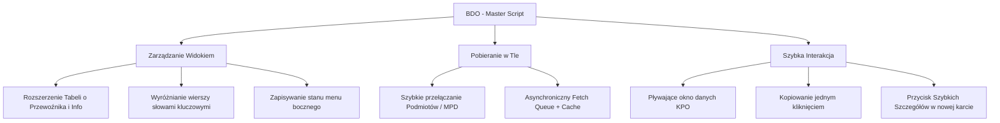

# ⚡ BDO - Master (v8.15)

> **Uproszczone raportowanie i zarządzanie kartami KPO w oficjalnym systemie rejestru BDO.**
> Skrypt stworzony na potrzeby optymalizacji procesu raportowania danych dla paliw alternatywnych w **PreZero National Sales PL**.

---

## 🚀 Główne Funkcje

Skrypt **BDO - Master** wprowadza szereg usprawnień do interfejsu oficjalnego rejestru BDO (`rejestr-bdo.mos.gov.pl`), automatyzując powtarzalne czynności i przyspieszając pracę z kartami przekazania odpadów (KPO).



### 1. 🚚 Rozszerzenie tabeli o dodatkowe informacje (Table Extender)
* Wzbogaca tabele kart KPO o dwie nowe, niezwykle przydatne kolumny: **Transportujący** oraz **Dodatkowe info** (np. numer awizacji, uwagi).
* Skrypt asynchronicznie odpytuje w tle szczegóły każdej karty i prezentuje je bezpośrednio w wierszu tabeli bez konieczności ręcznego wchodzenia w każdą kartę.
* Wyposażony w dedykowane, eleganckie podpowiedzi (tooltips) po najechaniu kursorem na komórki.

### 2. ⚡ Szybkie przełączanie Podmiotów / MPD (Miejsc Prowadzenia Działalności)
* Pozwala na natychmiastową zmianę aktywnego Podmiotu lub MPD bezpośrednio z menu górnego (najechanie myszką na nazwę firmy/punktu rozwinie listę z szybkim wyborem).
* Automatycznie pobiera listę dostępnych podmiotów i punktów w tle, oszczędzając czas spędzony na przechodzeniu przez standardowy, wieloetapowy proces przełączania.

### 3. 🔍 Szybkie szczegóły karty (Quick Details)
* Zastępuje standardowe, powolne menu rozwijane ("Akcje") bezpośrednim, widocznym na pierwszym planie przyciskiem **" Szczegóły"**.
* Kliknięcie otwiera kartę bezpośrednio w nowej zakładce w tle (`GM_openInTab`), co pozwala na płynną pracę seryjną.

### 4. 📌 Pływające okno danych KPO (Floating Info Window)
* Pojawia się na podglądzie karty KPO jako czytelny, ruchomy (draggable) i zwijalny panel boczny.
* Prezentuje w jednym miejscu najpotrzebniejsze parametry karty (np. Numer KPO, Masa Odbiorcy, Masa Deklarowana, Rejestracja Pojazdu, Awizacja itp.).
* **Kopiowanie jednym kliknięciem:** Kliknięcie na numer KPO lub masy automatycznie kopiuje je do schowka, co sygnalizowane jest zielonym błyskiem sukcesu.

### 5. 🎨 Inteligentne wyróżnianie wierszy (Row Highlight)
* Umożliwia automatyczne podświetlanie (na żółto) wierszy zawierających określone słowa kluczowe (np. nazwy konkretnych podmiotów lub odbiorców).
* Filtry konfiguruje się wygodnie w formie interaktywnych "tagów" (chips) bezpośrednio w panelu ustawień.

---

## 🛠️ Panel Ustawień (Settings Panel)

Dostęp do ustawień skryptu uzyskasz na dwa sposoby:
1. **Dedykowany przycisk (⚙️)** dodany w górnym pasku systemowym tuż obok nazwy zalogowanego użytkownika.
2. **Pływający przycisk koła zębatego** w lewym dolnym rogu ekranu (przydatny np. na ekranach, gdzie nie ma jeszcze paska górnego).

```
┌──────────────────────────────────────────────┐
│  ⚙️ Ustawienia BDO Master                    │
├──────────────────────────────────────────────┤
│  [X] Rozszerzenie tabeli o dodatkowe info    │
│  [X] Szybkie szczegóły karty (przycisk)      │
│  [X] Pływające okno danych w karcie KPO      │
│  [X] Szybkie przełączanie Podmiotów / MPD    │
│  [─] ──────────────────────────────────────  │
│  [X] Wyróżnianie wierszy tabeli (Odbierający)│
│      Tagi: [ EKO-MAR ✖ ] [ PREZERO ✖ ]       │
│      [ Wpisz nazwę...         ] [ + Dodaj ]  │
│  [─] ──────────────────────────────────────  │
│  [ Wyczyść Pamięć (Cache)                 ]  │
└──────────────────────────────────────────────┘
```

Z poziomu panelu możesz niezależnie włączać/wyłączać każdą z funkcji, zarządzać tagami podświetleń oraz zarządzać pamięcią podręczną skryptu.

---

## ⚙️ Architektura i Optymalizacja Techniczna

Skrypt został zaprojektowany z naciskiem na stabilność przeglądarki oraz bezpieczeństwo komunikacji z serwerem BDO:

* **Kolejkowanie zapytań (`FetchQueue`)**: Asynchroniczne pobieranie danych o przewoźnikach i uwagach odbywa się za pomocą kolejki z limitem współbieżności do **4 jednoczesnych połączeń**. Zapobiega to blokadom sieciowym i przeciążeniu serwerów BDO.
* **Pamięć podręczna (Session Cache)**: Pobrane dane kart KPO są zapisywane w `sessionStorage` z czasem życia (TTL) wynoszącym **4 godziny**. Dane kluczy są kodowane algorytmem Base64.
* **Bezpieczeństwo XSS**: Wszystkie dynamicznie wstrzykiwane dane tekstowe przechodzą przez autorską funkcję sanityzacji `escapeHtml`, zapobiegając atakom typu Cross-Site Scripting.
* **Zarządzanie zdarzeniami**: Zastosowano dynamiczny obserwator zmian DOM (`MutationObserver`) z mechanizmem **debounce** (100ms/150ms dla tabel), co całkowicie eliminuje zbędne przetwarzanie i spowalnianie przeglądarki.
* **Kontrola pamięci (`AbortController`)**: Przy przełączaniu zakładek lub resetowaniu widoku tabeli, aktywne zapytania sieciowe są natychmiast anulowane.

---

## 📥 Instalacja i Aktualizacja

Aby uruchomić skrypt, wymagane jest posiadanie menedżera skryptów użytkownika (UserScripts) w swojej przeglądarce.

### 1. Instalacja menedżera skryptów
Zainstaluj jedno z popularnych rozszerzeń do swojej przeglądarki:
* **Tampermonkey** ([Chrome Web Store](https://chrome.google.com/webstore/detail/tampermonkey/dhdgffkkebhmkfjojejmpbldmpobfkfo) / [Add-ons Firefox](https://addons.mozilla.org/pl/firefox/addon/tampermonkey/))
* **Violentmonkey** ([Strona główna rozszerzenia](https://violentmonkey.github.io/))

### 2. Dodanie skryptu BDO Master
1. Kliknij na ikonę zainstalowanego rozszerzenia i wybierz **"Utwórz nowy skrypt"**.
2. Usuń domyślny szablon kodu.
3. Skopiuj i wklej całą zawartość pliku [bdo-master.js](file:///Users/michaltkocz/Public/bdo-master/bdo-master.js).
4. Zapisz skrypt (`Ctrl + S` lub `Cmd + S`).

### 3. Automatyczne aktualizacje
Skrypt wspiera automatyczną aktualizację bezpośrednio z Twojego repozytorium GitHub za pomocą wbudowanych dyrektyw w nagłówku UserScript:
```javascript
// @updateURL    https://raw.githubusercontent.com/Zezolek1234/bdo-master/main/bdo-master.js
// @downloadURL  https://raw.githubusercontent.com/Zezolek1234/bdo-master/main/bdo-master.js
```

---

## 💡 Przydatne Wskazówki (Tips & Tricks)

> [!TIP]
> **Szybkie Kopiowanie:** Najważniejsze pole – **Masa Odbiorcy** – w pływającym oknie wyróżnia się **jasnoniebieskim tłem**. Kliknięcie na tę komórkę natychmiast skopiuje precyzyjną wartość liczbową do schowka, bez zbędnych spacji i znaków jednostki.

> [!NOTE]
> Jeżeli dane przewoźników w tabeli wydają się nieaktualne (np. po edycji karty), otwórz panel ustawień skryptu, kliknij **"Wyczyść Pamięć (Cache)"** i odśwież stronę.

> [!WARNING]
> Skrypt działa wyłącznie na oficjalnej domenie rejestru BDO: `https://rejestr-bdo.mos.gov.pl/*`. Wszelkie próby uruchomienia na środowisku testowym (IOŚ) wymagają ręcznej modyfikacji reguły `@match` w nagłówku skryptu.

---

## 👥 Metadane Projektu
* **Autor:** Michał Tkocz (PreZero National Sales PL)
* **Wersja:** 8.15
* **Wsparcie:** Narzędzie wewnętrzne, stworzone w celu maksymalizacji efektywności procesów rejestracji i weryfikacji KPO.
